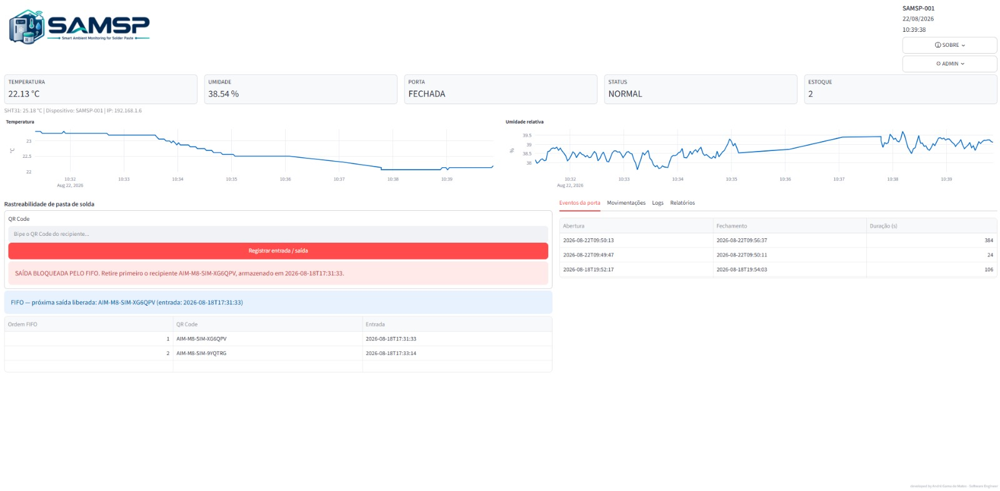
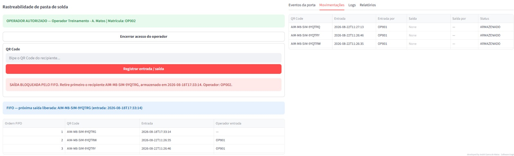
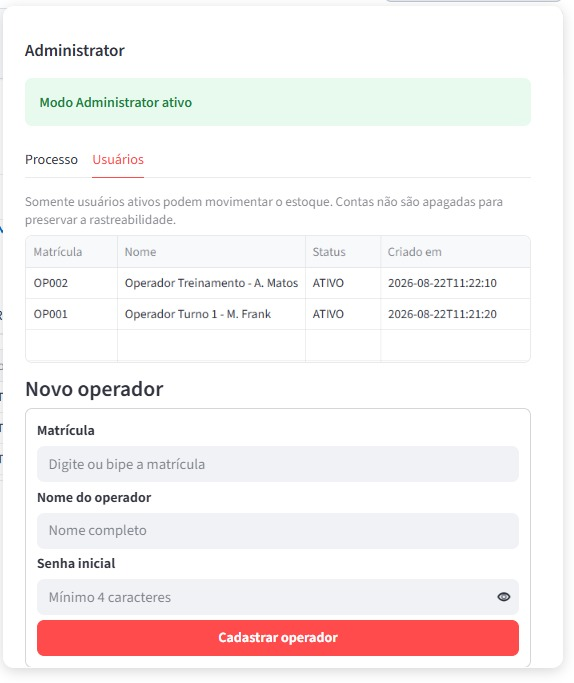

# SAMSP – Smart Ambient Monitoring for Solder Paste

Industrial IoT system for environmental monitoring, material traceability, and solder paste storage control in electronics manufacturing environments.

## System Preview

*SAMSP real-time monitoring dashboard for environmental conditions, alarms, door status, and material inventory.*

## Overview

**SAMSP – Smart Ambient Monitoring for Solder Paste** is an industrial monitoring and traceability solution designed to support the storage and handling of solder paste in electronics manufacturing environments.

The system integrates embedded hardware, environmental sensors, firmware, data acquisition, a web-based supervisory interface, and material traceability mechanisms into a single platform.

SAMSP was developed using **C++ and Python**, combining embedded systems, IoT, industrial monitoring, and hardware–software integration.

## Main Features

- Real-time temperature monitoring
- Real-time humidity monitoring
- Door open/close detection
- Door-open time monitoring
- Configurable thermal alarms
- Critical temperature alerts
- QR Code-based material traceability
- FIFO inventory control
- Operator authentication
- Operational event logging
- Historical process records
- Web-based industrial dashboard
- Administrative configuration interface
- ESP32 communication via USB/Serial
- Local network dashboard access

## Material Traceability

SAMSP provides QR Code-based material traceability for solder paste containers, supporting inventory control, material entry and withdrawal records, operator identification, and FIFO enforcement.

## Administration and Process Configuration

The administrative interface allows authorized users to configure process parameters, manage operators, define monitoring limits, and maintain system settings for the industrial environment.

## System Architecture

The SAMSP architecture combines:

**Embedded Layer**
- ESP32 microcontroller
- Temperature sensor
- Temperature and humidity sensor
- Magnetic door sensor
- Embedded firmware developed in C++

**Communication Layer**
- USB/Serial communication
- Structured device status messages
- Automatic serial device detection

**Application Layer**
- Python-based supervisory application
- Streamlit web interface
- SQLite database
- QR Code-based material tracking
- User and operator management
- Process monitoring and event logging

## Technologies

- Python
- C++
- ESP32
- Arduino Framework
- Streamlit
- SQLite
- Serial Communication
- QR Code
- IoT
- Embedded Systems
- Industrial Automation
- Hardware–Software Integration

## Intellectual Property

SAMSP is officially registered as a computer program with the Brazilian National Institute of Industrial Property (**INPI**).

**Registration:** BR512026007033-3  
**Title:** SAMSP – Smart Ambient Monitoring for Solder Paste  
**Year:** 2026  
**Authors:** André Gama de Matos and André Logan Almeida de Matos  
**RPI:** Revista da Propriedade Industrial No. 2904 – September 1, 2026

## Project Status

**Functional prototype – validated in laboratory environment.**

The current implementation includes embedded sensing, real-time monitoring, alarm management, inventory traceability, operator control, and network-accessible supervision.

## Repository Scope

This repository is intended as a **technical portfolio and project documentation repository**.

The complete production source code, customer-specific configurations, credentials, and proprietary implementation details are not publicly distributed through this repository.

## Authors

**André Gama de Matos**  
Electronics Test & R&D Engineer  
Embedded Systems | Test Automation | Industrial IoT | Computer Vision | Industrial AI

**André Logan Almeida de Matos**  
Co-author

## Citation

A DOI record for the SAMSP technical documentation will be made available through Zenodo.

## License and Intellectual Property Notice

Copyright © 2026 André Gama de Matos and André Logan Almeida de Matos.

SAMSP is a registered computer program protected under Brazilian intellectual property legislation.

The availability of technical documentation in this repository does not imply authorization to reproduce, commercialize, redistribute, or create derivative implementations of the registered software.
